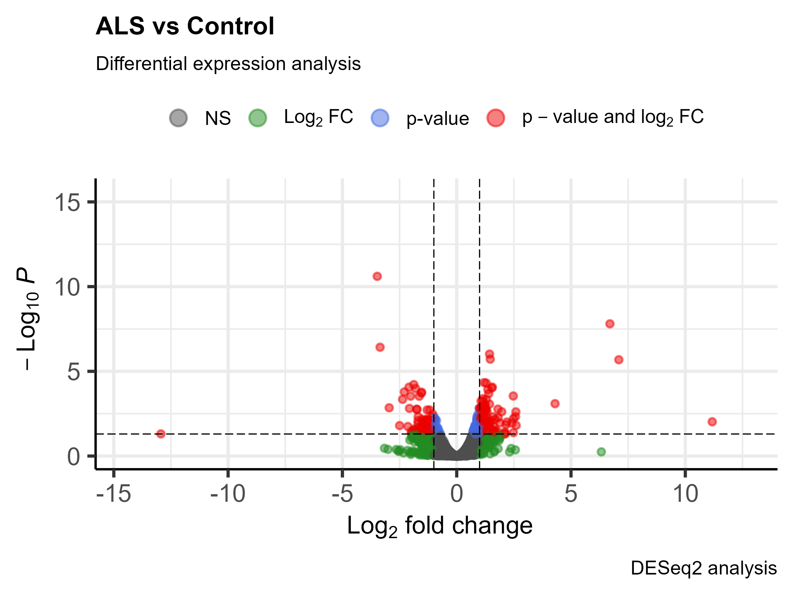
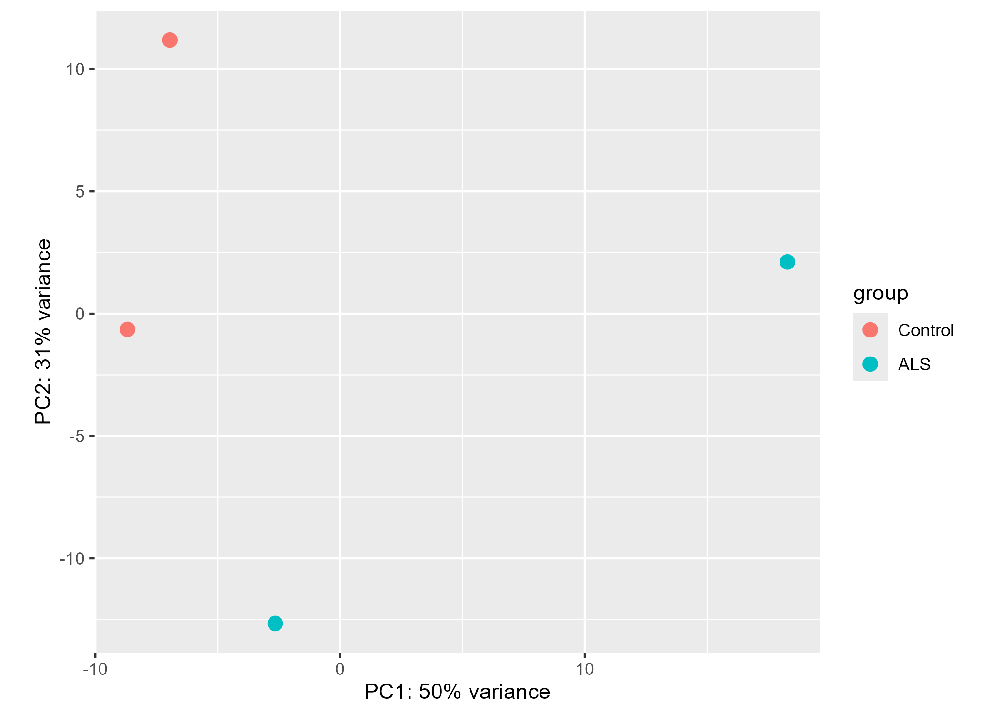

# ALS RNA-seq Differential Expression Pipeline

## Overview

This project presents an end-to-end bulk RNA-seq analysis workflow focused on transcriptomic alterations associated with Amyotrophic Lateral Sclerosis (ALS). The pipeline processes publicly available RNA-seq data from raw sequencing reads to differential expression analysis and biological interpretation.

The project integrates Linux/Bash processing, statistical analysis in R, exploratory visualization, and functional enrichment analysis to investigate molecular mechanisms potentially involved in ALS pathophysiology.

---

## Objectives

- Download and process public ALS RNA-seq datasets
- Perform sequencing quality control and trimming
- Align reads to the human reference genome
- Generate gene-level count matrices
- Perform differential expression analysis using DESeq2
- Visualize transcriptomic variability and sample clustering
- Identify significantly dysregulated genes
- Perform Gene Ontology enrichment analysis
- Build a reproducible bioinformatics workflow
- Develop a fully automated Nextflow pipeline

---

## Workflow

RNA-seq analysis workflow:

```text
Raw FASTQ
   ↓
Quality Control (FastQC / MultiQC)
   ↓
Read Trimming
   ↓
Alignment
   ↓
Feature Quantification
   ↓
Count Matrix Generation
   ↓
Differential Expression Analysis (DESeq2)
   ↓
PCA / Heatmap / Volcano Plot
   ↓
Functional Enrichment Analysis
```

---

## Technologies and Tools

### Workflow & Infrastructure
- Nextflow
- Bash
- Linux

### RNA-seq Processing
- FastQC
- MultiQC
- featureCounts

### Statistical Analysis
- R
- DESeq2
- tidyverse

### Visualization
- EnhancedVolcano
- pheatmap
- ggplot2

### Functional Analysis
- clusterProfiler
- Gene Ontology (GO)
- org.Hs.eg.db

---

## Project Structure

```text
rnaseq-als-pipeline/
│
├── scripts/        # Bash and processing scripts
├── reports/        # RMarkdown analysis and HTML reports
├── results/        # Counts, plots, enrichment outputs
├── metadata/       # Sample metadata
├── refs/           # Reference genome and annotations
├── main.nf         # Nextflow workflow
├── nextflow.config
└── README.md
```

---

## Main Results

The differential expression analysis identified multiple significantly dysregulated genes between ALS and control samples.

Main downstream analyses included:

- Volcano plot visualization
- Principal Component Analysis (PCA)
- Heatmap clustering
- Functional enrichment analysis

Enriched biological processes included:

- Synaptic vesicle transport
- Mitochondrial metabolism
- Energy production
- Chaperone-mediated autophagy

These pathways are frequently associated with neurodegenerative disease mechanisms and ALS pathophysiology.

---

## Example Outputs

### Volcano Plot



---

### PCA Plot



---

### Heatmap


---

## Current Status

Completed:
- RNA-seq processing
- Differential expression analysis
- Functional enrichment analysis
- RMarkdown report generation
- GitHub project organization

In progress:
- Full workflow automation using Nextflow DSL2
- Docker/Singularity reproducibility
- Workflow modularization

---

## Author

Julian Vitali  
MSc Bioinformatics & Biostatistics  
Barcelona, Spain

GitHub: https://github.com/julianv-12
